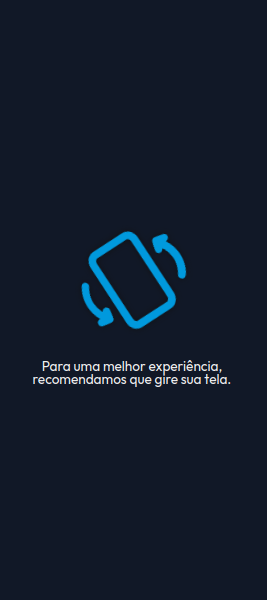
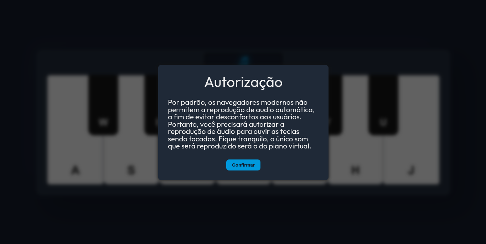
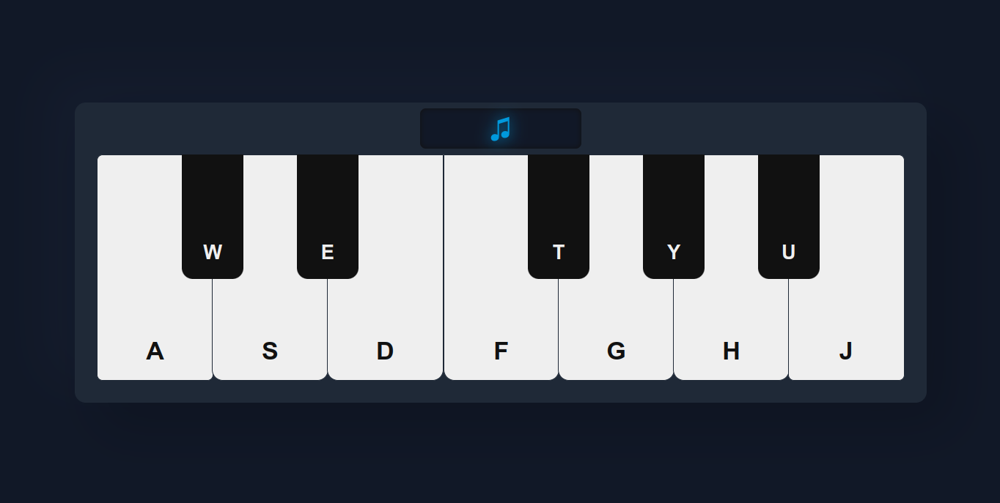

# Piano

Este projeto consiste em uma aplicação web que simula um piano virtual, onde é possível tocar diferentes notas musicais. A aplicação foi desenvolvida utilizando a biblioteca React, juntamente com a biblioteca styled-components para estilização dos componentes.

## Funcionalidades

- Reprodução de diferentes notas musicais.
- Atalhos do teclado para tocar as notas.
- Mensagem de autorização para reprodução de áudio.
- Mensagem de orientação para girar a tela do dispositivo, caso a largura seja menor do que a altura.

## Como o que foi feito

- React
- Styled Components
- <a href="https://www.flaticon.com/free-icons/screen-rotate" title="screen rotate icons">Screen rotate icons created by Flipicon - Flaticon</a>

## Como usar

Para utilizar a aplicação, basta acessar o link https://gpiano.vercel.app/ e interagir com os componentes disponíveis na tela.

## Teclas do teclado

As notas musicais podem ser tocadas através do teclado do computador, onde cada tecla representa uma nota específica. As teclas disponíveis são:

| Tecla | Nota musical |
| :---: | :----------: |
|   A   |      Do      |
|   w   |     Do#      |
|   S   |      Re      |
|   E   |     Re#      |
|   D   |      Mi      |
|   F   |      Fa      |
|   T   |     Fa#      |
|   G   |     Sol      |
|   Y   |     Sol#     |
|   H   |      La      |
|   U   |     La#      |
|   J   |      Si      |

## Toque na tela

Caso esteja acessando a aplicação por um dispositivo com tela sensível ao toque, é possível tocar as notas musicais diretamente na tela, utilizando os botões disponíveis.

## Como Instalar localmente

1. Faça o download do projeto em seu computador ou clone o repositório usando o seguinte comando:

```Shell
git clone https://github.com/Guilherme-Silva0/piano.git
```

2. Abra o terminal no diretório do projeto e execute o seguinte comando para instalar as dependências:

```Shell
npm install
```

3. Em seguida, execute o seguinte comando para iniciar a aplicação:

```Shell
npm run dev
```

4. A aplicação será aberta em seu navegador no endereço [http://localhost:5173](http://localhost:5173).

## Screeshots

- Rotação de tela:
  <br>
  

- Autorização
  

- Piano:
  

## Licença

Este projeto está sob a licença MIT. Para mais informações, consulte o arquivo LICENSE.

## Considerações finais

Espero que tenha gostado deste projeto! Se tiver alguma dúvida ou sugestão, por favor, sinta-se à vontade para entrar em contato.
